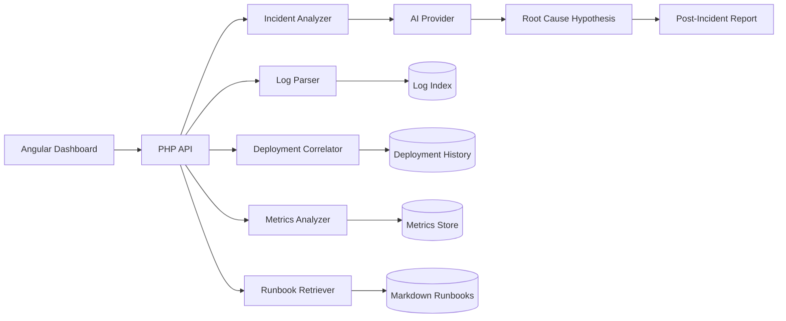

# AI Incident Copilot


AI Incident Copilot is a production-inspired incident investigation platform for engineering teams. It analyzes logs, deployments, metrics and runbooks, then generates a focused root-cause hypothesis, evidence trail, recommended actions and a post-incident report.

> Production incidents are expensive because engineers waste time jumping between logs, dashboards, deployments and documentation. AI Incident Copilot brings those signals together and helps teams investigate faster.


## Why this project exists

When production breaks, teams usually check many systems manually: application logs, deployment history, failed jobs, error traces, health checks, Grafana-style metrics, runbooks and recent configuration changes.

This project demonstrates how an AI assistant can reduce investigation time by correlating those signals and explaining what most likely happened.

## Quick Demo

```bash
git clone https://github.com/mayur-champaneria/ai-incident-copilot.git
cd ai-incident-copilot
cp .env.example .env
docker compose up -d
```

Open:

```text
Frontend: http://localhost:4200
Backend:  http://localhost:8080/api/health
```

No AI key is required for the demo because the fallback analyzer returns deterministic root-cause analysis. Add OpenAI or Ollama when you want live LLM reasoning.

## Key Features

- Modern incident dashboard with severity, status, service health and AI confidence
- Log ingestion and parsing for PHP/Symfony, Nginx, worker and generic application logs
- Deployment correlation to find suspicious releases before an incident
- Metrics anomaly detection for error rate, latency, queue backlog and service health
- Runbook retrieval using keyword scoring and optional LLM summarization
- AI investigation engine with OpenAI-compatible and Ollama-compatible providers
- Incident chat prompts for follow-up investigation questions
- Post-incident report generator in clean markdown format
- Docker Compose environment for local development
- Angular-style frontend architecture with modern responsive UI
- Symfony-style PHP backend architecture using controllers, services and DTOs

## Tech Stack

| Area | Technology |
|---|---|
| Frontend | Angular-style TypeScript, HTML, SCSS |
| Backend | PHP 8.3, Symfony-style service architecture |
| Search | Elasticsearch-compatible indexing concepts |
| Database | MySQL-compatible schema and sample data |
| AI | OpenAI-compatible API or local Ollama model |
| DevOps | Docker Compose, Nginx-style deployment, GitHub Actions |
| Docs | Markdown runbooks, architecture notes and incident reports |

## Architecture



## Demo Incidents

1. Checkout API 500 errors — missing payment timeout environment variable after deployment
2. Search API latency spike — expensive wildcard query introduced in search builder
3. Email queue backlog — worker memory exhaustion and failed retry processing
4. Login failures — Redis/session storage unavailable

## Example AI Output

```json
{
  "incident_id": "INC-2026-0042",
  "summary": "Checkout API started returning HTTP 500 errors shortly after deployment v1.8.3.",
  "likely_root_cause": "Missing PAYMENT_PROVIDER_TIMEOUT environment variable in the production deployment.",
  "confidence": 0.87,
  "evidence": [
    "Error spike started 8 minutes after deployment v1.8.3",
    "Logs contain Undefined env PAYMENT_PROVIDER_TIMEOUT",
    "Deployment changed payment configuration loader",
    "Runbook payment-service-failure.md matches the error signature"
  ],
  "recommended_actions": [
    "Restore PAYMENT_PROVIDER_TIMEOUT in production environment",
    "Restart checkout-api workers",
    "Add deployment validation for required env variables"
  ]
}
```

## Local Development

### Requirements

- PHP 8.2+
- Node.js 18+
- Docker and Docker Compose
- Optional: OpenAI API key or local Ollama

### Start with Docker

```bash
cp .env.example .env
docker compose up -d
```

### Run backend locally

```bash
cd backend
php -S 127.0.0.1:8080 -t public
```

### Run frontend locally

```bash
cd frontend
npm install
npm start
```

Open: `http://localhost:4200`

## AI Provider Configuration

Use OpenAI-compatible API:

```env
AI_PROVIDER=openai
OPENAI_API_KEY=your-key
OPENAI_MODEL=gpt-4o-mini
```

Or local Ollama:

```env
AI_PROVIDER=ollama
OLLAMA_BASE_URL=http://localhost:11434
OLLAMA_MODEL=llama3.1
```

The application includes a deterministic fallback analyzer, so the demo works even without an API key.

## API Endpoints

| Method | Endpoint | Description |
|---|---|---|
| GET | `/api/incidents` | List incidents |
| GET | `/api/incidents/{id}` | Get incident details |
| POST | `/api/incidents/{id}/analyze` | Generate AI root-cause analysis |
| GET | `/api/incidents/{id}/report` | Generate markdown post-incident report |
| GET | `/api/runbooks` | List available runbooks |
| GET | `/api/health` | API health check |

## Project Structure

```text
ai-incident-copilot/
├── backend/                 # PHP/Symfony-style API
├── frontend/                # Angular-style TypeScript frontend
├── data/                    # sample logs, deployments, metrics and incidents
├── docs/                    # architecture, workflows, runbooks and screenshots
├── docker-compose.yml
└── README.md
```

## Community

- Contributions: see [CONTRIBUTING.md](CONTRIBUTING.md)
- Security notes: see [SECURITY.md](SECURITY.md)
- Launch/share templates: see [docs/LAUNCH.md](docs/LAUNCH.md)
- Good first issues are available in the GitHub issue tracker

## What this demonstrates

- Full-stack product thinking
- AI-assisted production engineering
- Search and observability concepts
- Incident response workflows
- Clean API/service architecture
- Modern frontend dashboard design
- Documentation-first engineering

## Roadmap

- [x] Sample incident analyzer
- [x] Deployment and metrics correlation
- [x] Markdown runbook retrieval
- [x] AI provider abstraction
- [x] Incident report generator
- [ ] Real Elasticsearch indexing adapter
- [ ] GitHub commit correlation
- [ ] Slack/Teams incident transcript ingestion
- [ ] Grafana export import
- [ ] Jira ticket generator
- [ ] RBAC and team workspaces

## License

MIT
